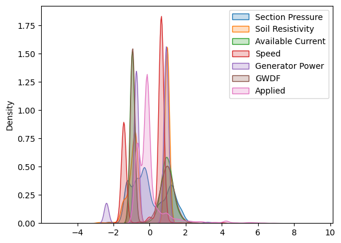
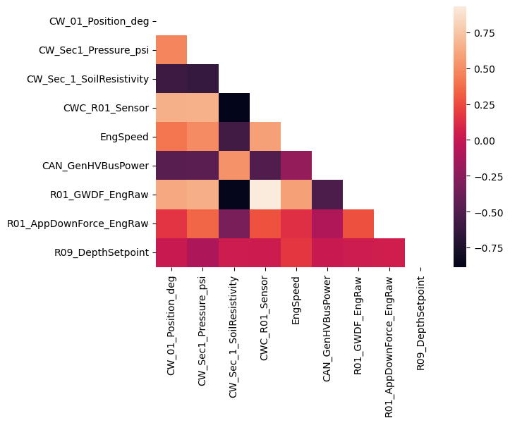
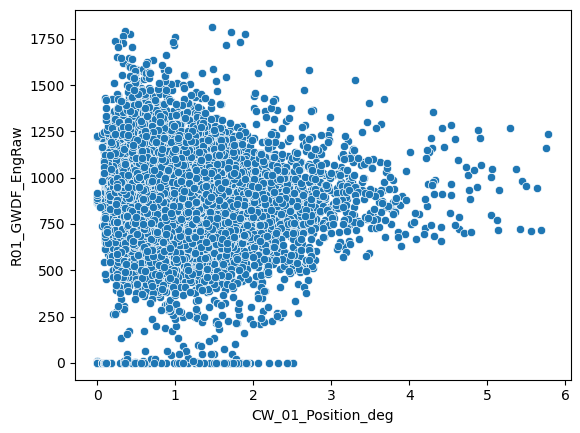
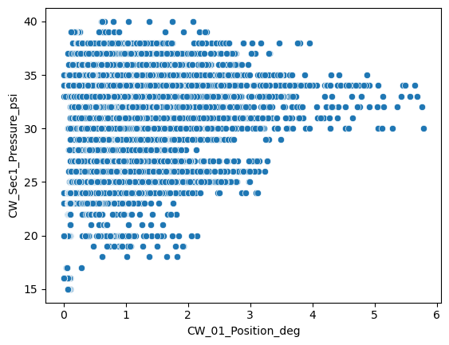
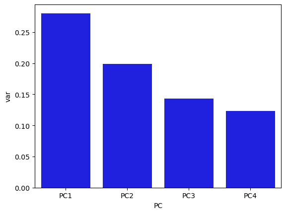
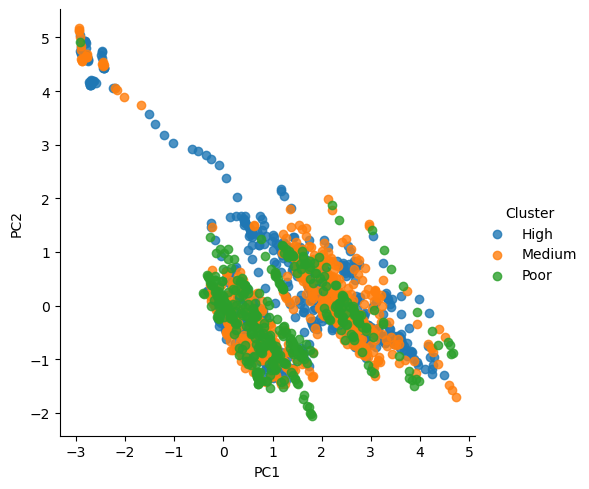

# Project Statement

I am conducting an analysis of sensor data collected during corn planting on a 12 row ExactEmerge planter. I am interested in learning the causes of variation in closing wheel performance. In general, when comparing conservation-tilled fields, closing performance increases as closing wheel average acceleration decreases. This is only to a certain point, however, since overcompaction can also lead to negative effects. Therefore, for a specific field and pressure, I will observe the influence of depth, speed, soil characteristics, draft force, and power availability on overall closing performance.

# Data Acquisition

Our control system utilizes a MicroAutoBox connected to a high-speed CAN bus to send and receive signals that read sensor inputs and manage the electronic depth actuators, pneumatic controllers and user interface. This CAN bus also to a gateway which we use as a diagnostic port to log these signals in an ASCII text format.

Here is a list of relevant non-native sensors installed for this project:

### Rotary encoders for cleaning and closing wheels


<br>
<br>

### Inertial Measurement Units (IMU) for acceleration data on row unit


<br>
<br>

### Valve stack pressure sensor for pneumatic pressure


<br>
<br>

### And a LOT of monitors


<br>
<br>

All of these sensors work in conjunction to provide a clear image of planter dynamics and teach us how we can improve the planting process. When the data is logged, it is converted to a .mat file which can be imported into python for further analysis:

```python
data = mat73.loadmat(r"C:\Users\cbethany\Desktop\Fall Seeding\Analysis\Files\FieldLogs\Spring_2023_West80_20230413.mat")
field_df = pd.DataFrame(data=data)
field_df.head()
```
A single repetition in the data can often include multiple passes. Logging is paused near the end of passes to avoid data that is skewed by the operator influence, since at the end of the rows they will often adjust the heading slightly, slow down, or even lift the planter early. Let's consider a set of 5 repetitions which cumulatively represents about 45 minutes of planting at relative equilibrium.

```python
Rep1_df = pd.DataFrame(data = field_df.SD_12R_West80_230413112819_Rep_1.CANsignals_Downsample)
Rep2_df = pd.DataFrame(data = field_df.SD_12R_West80_230413131744_Rep_2.CANsignals_Downsample)
Rep3_df = pd.DataFrame(data = field_df.SD_12R_West80_230413132611_Rep_3.CANsignals_Downsample)
Rep4_df = pd.DataFrame(data = field_df.SD_12R_West80_230413133937_Rep_4.CANsignals_Downsample)
Rep5_df = pd.DataFrame(data = field_df.SD_12R_West80_230413135235_Rep_5.CANsignals_Downsample)
Total_df = pd.concat([Rep1_df, Rep2_df, Rep3_df, Rep4_df, Rep5_df], ignore_index=True)
Total_df_filtered = Total_df[['CW_01_Position_deg', 'CW_Sec1_Pressure_psi', 'CW_Sec_1_SoilResistivity', 'CWC_R01_Sensor', 'EngSpeed', 'CAN_GenHVBusPower', 'R01_GWDF_EngRaw', 'R01_AppDownForce_EngRaw', 'R09_DepthSetpoint']].copy()
Total_df_filtered.dropna()
```

During extraction from ASCII text to a mat file, I downsample all signals since some of them report at a high frequency. Then in the jupyter notebook I use dropna() to exclude all rows with a NaN value. This allows me to easily compare one signal to another without worrying if the time basis lines up. We'll observe eight relevant signals that can influence the closing wheel position:

 
> **Section Pressure** <br>
> The measured air pressure at the valve stack which supplies air to the closing wheel pneumatic bags.
 
> **Soil Resistivity** <br>
> The estimated measure of soil penetration resistance I created using the summation of Y-axis forces across the row unit.

> **Current Sensor** <br>
> The measured current availability for the closing wheel controller and valves. This is important because power availability is slim on a tractor with so many electronics. This can often be a pinch point for high-amperage control systems.
 
> **Engine Speed** <br>
> The engine speed measured in RPMs. We don't actually measure ground speed on the wheels and we don't have access to the GPS speed, but we only use one gear while planting so engine speed is synonymous with ground speed at equilibrium. It 
> doesn't tell actual ground speed, but we know as engine speed increases, so does ground speed. It is not a perfectly linear relationship, but the small variance from 5 to 9 miles per hour is negligible.
 
> **EPG Power** <br>
> The total voltage from the Electronic Power Generator. Another pinch point for power availability is the lag in electronic power generation. The EPG is suppose to generate 56V consistently, but can often lag with many control systems 
> drawing from it.

> **GWDF** <br>
> An acronym for gauge wheel downforce, a measurement of hydraulic pressure on the hinge that provides the main vector for pressing the cutting discs into the soil.

> **Applied Downforce** <br>
> The calculated total downforce being exerted by the hydraulic cylinder. Not all of this pressure is being translated to the row unit as GWDF and settings such as speed, depth, cleaning, and closing pressures can change this ratio.

> **Depth Setpoint** <br>
> The desired planting depth used by the row unit actuators to adjust the furrow.  

# Analysis

I am interested in the deviation of the closing wheels, not just the raw position. Every 10 signals, or 1 second, I am going to do a rolling standard deviation to understand the variation in position over that time. In general, the larger the standard deviation, the worse closing performance. Additionally, once this is done we will remove any rows where soil resistivity is zero. Sometimes logging does not turn on and off quick enough and we can often keep logging when we pick up over waterways. This is a good way to ensure we are only looking at values during ground engagement.

```python
Total_df_filtered['CW_01_Position_deg'] = Total_df_filtered['CW_01_Position_deg'].rolling(window=10, min_periods=1).std()
Total_df_filtered = Total_df_filtered.dropna()
Total_df_filtered = Total_df_filtered[Total_df_filtered['CW_Sec_1_SoilResistivity'] != 0]
```
Now that we have the data formatted the way we want, I would like to see a KDE plot to see the distribution of each signal. 

```python
X_data = Total_df_filtered.iloc[:,1:9]
Y_data = Total_df_filtered.iloc[:,0:1]
scaled_data = StandardScaler()
scaled_X = scaled_data.fit_transform(X_data)
labels = ('Section Pressure', 'Soil Resistivity', 'Available Current', 'Speed', 'Generator Power', 'GWDF', 'Applied', 'Depth')
for i, column in enumerate(X_data.columns):
    sns.kdeplot(data=scaled_X[:,i], shade=True, label=labels[i])
plt.legend()
```



We only made small changes to the depth setpoints, so I doubt we see that play much of role. This test could be expanded to test a wider range of depths but for now this will be enough. There are good variations of downforce, resistivity, current draws, and speeds.
<br>
Let's see the correlation between these characteristics and pay close attention to the position column. We might be able to identify some trends that influence closing performance.

```python
corr = Total_df_filtered.corr(method='pearson')
mask=np.zeros_like(corr)
mask[np.triu_indices_from(mask)] = True
sns.heatmap(corr, mask=mask)
```



Immediately I notice a strong trend with soil resistivity and gauge wheel downforce. Let's explore this further with a regression.

```python
sns.scatterplot(x=Total_df_filtered['CW_01_Position_deg'], y=Total_df_filtered['R01_GWDF_EngRaw'])
```



Interestingly, it looks like we should avoid downforces beyond 750N. You can see the standard deviation improves toward the top end, but that is likely in the overcompaction zone which will decrease closing performance and yield.

```python
sns.scatterplot(x=Total_df_filtered['CW_01_Position_deg'], y=Total_df_filtered['CW_Sec1_Pressure_psi'])
```


Another interesting observation, it seems that air pressures above 30 psi may actually negatively influence closing performance. This is something we have discussed previously at work, as we've observed high pressures having a tendency to "throw" the closing wheels downward in large residue. We want to see a relatively even ride, not necessarily too much bouncing which is leaving parts of the furrow open but also not so much that the closing wheel is crashing over and picking up every bit of residue. It seems that around 25 psi was the right pressure for this particular field, since above that was likely overcompaction and below is not effective closing. <br>
<br>
To try and reduce the dimensionality of this closing performance issue, I will perform a principal component analysis. With 4 components, we can cut down on the complexity of the inputs and hopefully better understand how closing performance is influenced. I am also going to set a range of closing performance. A standard deviation of 0.5 or less is considered high quality, 0.5 to 1 is medium quality, and anything beyond 1 is poor quality.

```python
pcal = PCA(n_components = 4)
pcal.fit(scaled_X)
trained_pcal = pcal.transform(scaled_X)
pc_df = pd.DataFrame(data = trained_pcal, columns = ['PC1', 'PC2', 'PC3', 'PC4'])
pc_df['Cluster'] = Y_data
pc_df = pc_df.dropna()
bins = [0, 0.5, 1, float('inf')]
labels = ['High', 'Medium', 'Poor']
pc_df['Cluster'] = pd.cut(abs(pc_df['Cluster']), bins=bins, labels=labels)
pcal.explained_variance_ratio_
df = pd.DataFrame({'var':pcal.explained_variance_ratio_, 'PC':['PC1', 'PC2', 'PC3', 'PC4']})
sns.barplot(x='PC', y='var', data=df, color='blue')
p = sns.lmplot( x="PC1", y="PC2", data=pc_df, fit_reg=False, hue='Cluster', legend=False, height=8, aspect=1.5)
```





# Reflection

Ultimately, any ground engaging analysis is subject to a lot of factors. Some of them we can control, some we cannot. In the regression analysis we learned some quality information about which downforce and air pressures we should target. For this particular field, it is clear that 25 psi of air pressure per section and around 600N of downforce are likely the most effective settings for closing performance. The PCA analysis is less conclusive, with PC1 only classifying about 30% and the overlap of high, medium and poor shows very little promise. This could possibly be remedied with intentional testing at a wide range of settings, rather than the small differences in some characteristics I recorded during production planting. There are also many other factors that should be considered when setting these targets and optimizing closing performance may mean sacrificing other areas so these characteristics should be weighted with careful consideration.
