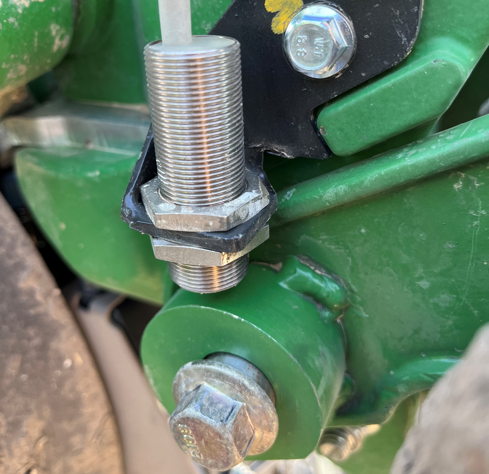

# Project Statement

I am conducting an analysis of sensor data collected during corn planting on a 12 row ExactEmerge planter. I am interested in learning the causes of variation in closing wheel performance. In general, when comparing conservation-tilled fields, closing performance increases as closing wheel average acceleration decreases. This is only to a certain point, however, since overcompaction can also lead to negative effects. Therefore, for a specific field and pressure, I will observe the influence of depth, speed, soil characteristics, draft force, and power availability on overall closing performance.

# Data Acquisition

Our control system utilizes a MicroAutoBox connected to a high-speed CAN bus to send and receive signals that read sensor inputs and manage the electronic depth actuators, pneumatic controllers and user interface. This CAN bus also to a gateway which we use as a diagnostic port to log these signals in an ASCII text format.

Here is a list of relevant non-native sensors installed for this project:

### Rotary encoders for cleaning and closing wheels


<br>
<br>

### Inertial Measurement Units (IMU) for acceleration data on row unit


<br>
<br>

### Valve stack pressure sensor for pneumatic pressure


<br>
<br>

### And a LOT of monitors


<br>
<br>

All of these sensors work in conjunction to provide a clear image of planter dynamics and teach us how we can improve the planting process. When the data is logged, it is converted to a .mat file which can be imported into python for further analysis:

```python
data = mat73.loadmat(r"C:\Users\cbethany\Desktop\Fall Seeding\Analysis\Files\FieldLogs\Spring_2023_West80_20230413.mat")
field_df = pd.DataFrame(data=data)
field_df.head()
```
A single repetition in the data can often include multiple passes. Logging is paused near the end of passes to avoid data that is skewed by the operator influence, since at the end of the rows they will often adjust the heading slightly, slow down, or even lift the planter early. Let's consider a set of 5 repetitions which cumulatively represents about 45 minutes of planting at relative equilibrium.

```python
Rep1_df = pd.DataFrame(data = field_df.SD_12R_West80_230413112819_Rep_1.CANsignals_Downsample)
Rep2_df = pd.DataFrame(data = field_df.SD_12R_West80_230413131744_Rep_2.CANsignals_Downsample)
Rep3_df = pd.DataFrame(data = field_df.SD_12R_West80_230413132611_Rep_3.CANsignals_Downsample)
Rep4_df = pd.DataFrame(data = field_df.SD_12R_West80_230413133937_Rep_4.CANsignals_Downsample)
Rep5_df = pd.DataFrame(data = field_df.SD_12R_West80_230413135235_Rep_5.CANsignals_Downsample)
Total_df = pd.concat([Rep1_df, Rep2_df, Rep3_df, Rep4_df, Rep5_df])
Total_df_filtered = Total_df[['CW_01_Position_deg', 'CW_Sec1_Pressure_psi', 'CW_Sec_1_SoilResistivity', 'CWC_R01_Sensor', 'EngSpeed', 'CAN_GenHVBusPower', 'R01_GWDF_EngRaw', 'R01_AppDownForce_EngRaw', 'R09_DepthSetpoint']].copy()
Total_df_filtered.dropna()
```

During extraction from ASCII text to a mat file, I downsample all signals since some of them report at a high frequency. Then in the jupyter notebook I use dropna() to exclude all rows with a NaN value. This allows me to easily compare one signal to another without worrying if the time basis lines up. We'll observe eight relevant signals that can influence the closing wheel position:

 
> **Section Pressure** <br>
> The measured air pressure at the valve stack which supplies air to the closing wheel pneumatic bags.
 
> **Soil Resistivity** <br>
> The estimated measure of soil penetration resistance I created using the summation of Y-axis forces across the row unit.

> **Current Sensor** <br>
> The measured current availability for the closing wheel controller and valves. This is important because power availability is slim on a tractor with so many electronics. This can often be a pinch point for high-amperage control systems.
 
> **Engine Speed** <br>
> The engine speed measured in RPMs. We don't actually measure ground speed on the wheels and we don't have access to the GPS speed, but we only use one gear while planting so engine speed is synonymous with ground speed at equilibrium. It 
> doesn't tell actual ground speed, but we know as engine speed increases, so does ground speed. It is not a perfectly linear relationship, but the small variance from 5 to 9 miles per hour is negligible.
 
> **EPG Power** <br>
> The total voltage from the Electronic Power Generator. Another pinch point for power availability is the lag in electronic power generation. The EPG is suppose to generate 56V consistently, but can often lag with many control systems 
> drawing from it.

> **GWDF** <br>
> An acronym for gauge wheel downforce, a measurement of hydraulic pressure on the hinge that provides the main vector for pressing the cutting discs into the soil.

> **Applied Downforce** <br>
> The calculated total downforce being exerted by the hydraulic cylinder. Not all of this pressure is being translated to the row unit as GWDF and settings such as speed, depth, cleaning, and closing pressures can change this ratio.

> **Depth Setpoint** <br>
> The desired planting depth used by the row unit actuators to adjust the furrow.  

# Analysis

```js
// Javascript code with syntax highlighting.
var fun = function lang(l) {
  dateformat.i18n = require('./lang/' + l)
  return true;
}
```

```ruby
# Ruby code with syntax highlighting
GitHubPages::Dependencies.gems.each do |gem, version|
  s.add_dependency(gem, "= #{version}")
end
```

#### Header 4

*   This is an unordered list following a header.
*   This is an unordered list following a header.
*   This is an unordered list following a header.

##### Header 5

1.  This is an ordered list following a header.
2.  This is an ordered list following a header.
3.  This is an ordered list following a header.

###### Header 6

| head1        | head two          | three |
|:-------------|:------------------|:------|
| ok           | good swedish fish | nice  |
| out of stock | good and plenty   | nice  |
| ok           | good `oreos`      | hmm   |
| ok           | good `zoute` drop | yumm  |

### There's a horizontal rule below this.

* * *

### Here is an unordered list:

*   Item foo
*   Item bar
*   Item baz
*   Item zip

### And an ordered list:

1.  Item one
1.  Item two
1.  Item three
1.  Item four

### And a nested list:

- level 1 item
  - level 2 item
  - level 2 item
    - level 3 item
    - level 3 item
- level 1 item
  - level 2 item
  - level 2 item
  - level 2 item
- level 1 item
  - level 2 item
  - level 2 item
- level 1 item

### Small image


### Large image


### Definition lists can be used with HTML syntax.

<dl>
<dt>Name</dt>
<dd>Godzilla</dd>
<dt>Born</dt>
<dd>1952</dd>
<dt>Birthplace</dt>
<dd>Japan</dd>
<dt>Color</dt>
<dd>Green</dd>
</dl>

```
Long, single-line code blocks should not wrap. They should horizontally scroll if they are too long. This line should be long enough to demonstrate this.
```

```
The final element.
```
